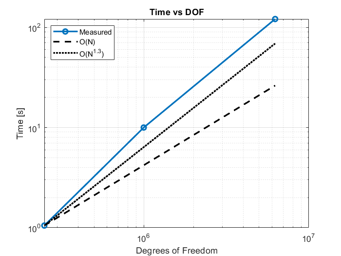
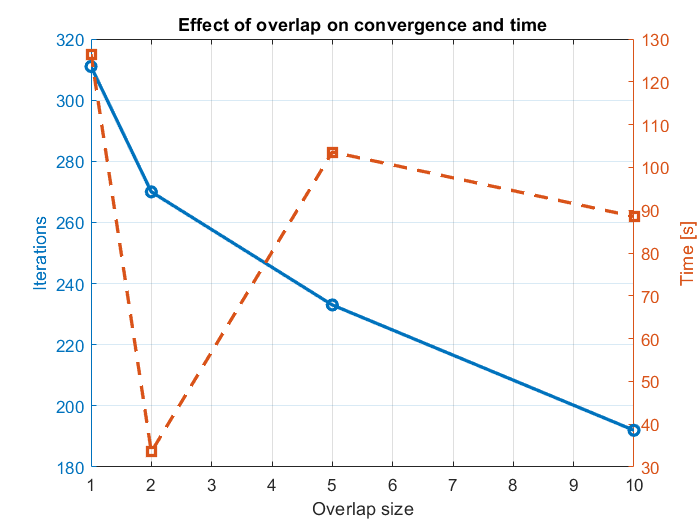

**Advanced Methods for Scientific Computing**  
Politecnico di Milano, January 2026

| Author | Person code |
| :----- | :---------: |
| Micaela Perlini | 10860443 |
| Francesca Marina Pozzi | 10837189 |
| Martina Rusconi | 10857811 |

</br>

# Restricted Additive Schwarz preconditioner with coarse correction on a 2D domain

This project aims to numerically solve the following **2D diffusion-reaction problem** 

$$
\begin{aligned}
\begin{cases}
-\mu\Delta u(x,y) + cu(x,y) = 1 &(x,y)\in\Omega \\
u(x,y)=0 &(x,y)\in\partial\Omega
\end{cases}
\end{aligned}
$$

where:
- $\Omega$ is a square domain
- $\mu>0$ is the diffusion coefficient
- $c\geq0$ is the reaction coefficient
- $f=1$ is the forcing term
- $\Delta$ is the Laplacian operator
- The boundary conditions are of *homogeneous* Dirichlet type

</br>

## Discretization

The PDE problem is discretized on a **uniform** `Nx`$\times$`Ny` **grid** using **finite differences with a 5-point stencil**:

```
        u(i,j+1)
           |
u(i-1,j)--u(i,j)--u(i+1,j)
           |
        u(i,j-1)
```

The resulting discrete operator is given by: 

$$
\begin{aligned}
Au&=\frac{\mu}{h_x^2}\bigg[ -u(i-1,j)+2u(i,j)-u(i+1,j) \bigg]+ \\
&+\frac{\mu}{h_y^2}\bigg[ -u(i,j-1)+2u(i,j)-u(i,j+1) \bigg] + \\
&+cu(i,j)
\end{aligned}
$$

</br>

## Code structure

The solver uses a parallel distributed approach based on **MPI communication**.

Our strategy has been developed focusing on the following aspects:
1. **Domain decomposition**  
    The computational domain is partitioned using a 2D cartesian grid and divided among MPI processes.
2. **Overlapping subdomains**  
    Each process solves a local subproblem defined on a region which is overlapping with the ones of neighbors (Restricted Additive Schwarz method).
3. **Two-level preconditioning**  
    The local preconditioning technique (RAS) is combined with a coarse correction to make the alorithm scalable.
4. **Krylov solver**  
    BiCGSTAB iterative method is used to solve the global system.

</br>

### Implementation decisions

RAS method requires to define an **overlap region** to improve convergence. For this reason, a "core" region is *uniquely* assigned to each process, but the solution of the local problem occurs on an "extended" region (core $+$ overlap). 

The information exchange exploits ghost cells to preform matrix-vector product (1-layer overlap) and customizable overlap size for the RAS method itself.

</br>

Moreover, to make MPI communication more performing, we chose to use `MPI_Sendrecv` to implement **simultaneous bidirectional exchanges** between neighboring processes. Indeed, this avoids deadlocks and reduces latency.

Processes on global boundaries communicate with `MPI_PROC_NULL`.

</br>

Increasing the number of processes produces a higher degree of parallelism, which is useful when the problem sizes are close to the real world ones. However, RAS alone *does not* provide scalability: convergence rate degrades as the number of workers grows.

The **coarse correction** is then used to provide global coupling and implicit comminication in order to restore convergence rate.

The coarse grid size is chosen automatically, looking for a **trade-off** between computational costs and preconditioning effectiveness.

</br>

Lastly, the final choice of the iterative solver for the global problem fell on **BiCGSTAB**. Indeed, it is a method suited for unsymmetric linear systems (but behaves as Conjugate Gradient with symmetric ones) that provides fast convergence.

Also GMRES is available in the code but commented: it guarantees convergence but is preferable to be used for badly conditioned problems.

</br>

### Memory usage

The system matrix is stored in a **CSR sparse format** in such a way that only the non-zero coefficients are allocated.

Data have a row-major ordering to be consistent with Eigen, but also to enhance **coalescent and cache-friendly accesses**.

</br>

### Configuration parameters

The program accepts the following parameters:

| Variable name | Symbol | Description | 
| :-----------: | :----: | :---------- |
| `Nx` | $N_x$ | Number of fine grid nodes along $x$ axis |
| `Ny` | $N_y$ | Number of fine grid nodes along $y$ axis |
| `Lx` | $L_x$ | Domain length along $x$ axis |
| `Ly` | $L_y$ | Domain length along $y$ axis |
| `mu` | $\mu$ | Diffusion coefficient |
| `c` | $c$ | Reaction coefficient |
| `overlap` | - | Overlap size in number of nodes |
| `max_it` | - | Maximum number of iterations for the iterative solver |
| `tol` | - | Tolerance |
| `restart` | - | Restart for GMRES |

Grid sizes along $x$ and $y$ are computed as follows:

$$
\begin{aligned}
h_x=\frac{L_x}{N_x-1},\quad h_y=\frac{L_y}{N_y-1}
\end{aligned}
$$

</br>

### Classes

- `Partition`  
    It handles the domain partitioning between MPI processes.

    </br>

    | Key methods | Roles |
    | :---------: | :---- |
    | `compute_1d_partition(int N, int nb, int proc_id, int& start, int& len)`| Divides `N` nodes into `nb` blocks as evenly as possible, and returns the starting index (`start`) and subdomain length (`len`) for the process `proc_id`. |
    | `find_best_coarse_grid(int Nf, int target_ratio)` | Determines the optimal coarse grid size by looking for factors of `Nf - 1` that are the closest to the `target_ratio` (in this case we would like the fine grid spacings to be about $1/20$ of the coarse ones). |

</br>

- `CoarseSolver`  
    It implements the coarse correction for the two-level preconditioner.

    </br>

    | Key methods | Roles |
    | :---------: | :---- |
    | `CoarseSolver(int Nx_, int Ny_, int Ncx_, int Ncy_, double mu_, double c_, int rank_)` | Assembles the matrix `Ac` defined on the coarser grid, applies on it the same differential operator as the one for the fine grid, and executes the sparse LU factorization. |
    | `solve(const Eigen::VectorXd& r_local, Eigen::VectorXd& e_local, int ci_s, int cj_s, int core_nx, int core_ny, MPI_Comm comm_to_use)` | Injects from the fine residual to the coarse one, solves `Ac*ec = rc` using LU factorization to eliminate low frequency error components, and then uses bilinear interpolation to prolongate the correction to the fine grid. |

</br>

- `LocalProblem`  
    It handles the local subproblem with overlap.

    </br>

    | Key methods | Roles |
    | :---------: | :---- |
    | `assemble_and_factorize()` | Assembles the local matrix `A_loc` on the extended region, applies global Dirichlet boundary conditions, and executes sparse LU factorization. |
    | `apply_RAS(const Eigen::VectorXd& r_core, Eigen::VectorXd& z_core)` | Extends `r_core` with zeros in overlap positions, computes the local solution `z_loc = A_loc^(-1) * r_loc`, and then extracts only core values from `z_loc`. |

    </br> 

    This implements RAS method. Indeed, each process solves locally with overlap but returns the correction defined only on its core region.

</br>

- `Solver`  
    The main class, it coordinates the parallel solution of the linear system.

    </br> 

    | Key methods | Roles |
    | :---------: | :---- |
    | `matvec(const Eigen::VectorXd& p, Eigen::VectorXd& Ap)` | Computes the matrix-vector product `Ap = A*p` in a distributed manner, using MPI communication to exchange ghost cells and exploiting the 5-point stencil. |
    | `apply_RAS(const Eigen::VectorXd& r, Eigen::VectorXd& z)` | Delegates the RAS preconditioning to `LocalProblem`. |
    | `apply_TwoLevel(const Eigen::VectorXd& r_local, Eigen::VectorXd& z_local)` | Applies fine RAS, performs the coarse correction, and then adds together the results with a damping term to improve preconditioner stability. |
    | `dot_global(const Eigen::VectorXd& a, const Eigen::VectorXd& b)` | Computes the distributed scalar product exploiting `MPI_Allreduce`. |
    | `run(int max_it, double tol, int m_restart, const double hx, const double hy)` | Calls preconditioned BiCGSTAB (or GMRES), and then gathers and saves the global solution. |
    | `gather_and_save(const Eigen::VectorXd& x_local, const double hx, const double hy)` | Aggregates the distributed solution and saves it to a `.csv` file. |

</br>

### Entry point

`main.cpp` initializes MPI communication and can handle input parameters in two ways:
- Taking arguments from command line
- Using interactive input interface, implemented through the utility function `ask_param`.

</br>

MPI processes are distributed into a logic **2D cartesian grid**:
1. `MPI_Dims_create` to decide how to divide processes
2. `MPI_Cart_create` to create a cartesian communicator
3. `MPI_Cart_shift` to identify neighbors to exchange overlap values with

</br>

The global `Nx`$\times$`Ny` grid is subdivided into local subdomains: each process becomes responsible for a specific core region.

</br>

After creating `LocalProblem` and `Solver`, the latter one is run using `solver.run()`. The execution time is measured using `std::chrono`, ensuring that all processes are synchronized at the beginning and at the and of the computation phase.


</br>

### External dependencies

- **MPI** for parallel communication
- **Eigen3** for linar algebra
- **Custom libraries** such as `gmres.hpp` and `bicgstab.hpp` for iterative solvers

</br>

## Performance and scaling

<u>Note</u>: this implementation is intrinsically parallel.

Some parameters were fixed to guarantee a simpler analysis:
- Domain $\Omega=[0,1]^2$
- Diffusion coefficient $\mu=1.0$
- Reaction coefficient $c=0.1$
- Maximum number of iterations is 5000
- Tolerance is 1e-06

In this section we will use the following formulas:

$$
\begin{aligned}
&T_\text{ideal}(p)=T(2)\frac{2}{p} \\
&S(p)=\frac{T(2)}{T(p)} \\
&S_\text{ideal}(p)=\frac{p}{2} \\
&E(p)=2\frac{S(p)}{p}
\end{aligned}
$$

where:
- $p$ is the number of processors
- $T(p)$ is the parallel time with $p$ processors
- $S(p)$ is the speedup with $p$ processors (with respect to the 2 processors case)
- $E(p)$ is the efficiency with $p$ processors

</br>

### Strong scaling 

- Global grid size: 2500 $\times$ 2500
- Coarse grid size: 120 $\times$ 120
- Overlap size: 2


| Number of processors | Number of iterations | Timing | Speedup w.r.t. 2 processors case |
| :------------------: | :------------------: | :----: | :---: |
| 2 | 158 | 617.024 s | 1.0 |
| 4 | 169 | 329.039 s | 1.87 |
| 8 | 227 | 215.841 s | 2.86 |
| 16 | 268 | 135.133 s | 4.57 |
| 20 | 279 | 121.184 s | 5.09 |


The algorithm provides a **realistic strong scaling**, proving that MPI communication costs are overriden by factorization costs when computations are performed by less processes.


</br>

### Scaling with problem size

Fixed number of processors: 20.


| Global grid size | Coarse grid size | Overlap size |Number of iterations | Timing | 
| :---: | :---: | :---: | :---: |
| 5000x5000 |250x250| 5 | 327 | 703.2 s |
| 2500x2500 | 120x120 | 2 | 279 | 121.184 s | 
| 2500x1000 | 120x38 | 2 | 270 | 33.54 s |
| 1000x1000 | 38x38 | 2 | 171 | 10.004 s |
| 500x500 | 25x25 | 1 | 85 | 1.051 s |


Iterations number grows slowly with the problem, meaning that the **coarse solver controls global low frequencies**.

 

</br>

### Overlap impact

- Global grid size: 2500 $\times$ 2500
- Coarse grid size: 120 $\times$ 120
- Number of processors: 20


| Overlap size | Number of iterations | Timing |
| 1 | 311 | 126.46 s |
| 2 | 270 | 33.54 s |
| 5 | 233 | 103.594 s |
| 10 | 192 | 88.526 s |


Overlap size equal to 2 is clearly the optimal one: it provides a moderate number of iterations and minimal communication.



</br>

## Code usage

It is possible to clone this repository using

```
git clone https://github.com/francescapozzi3/dd-02-dd
```

</br>

Then go to `\src` directory 
```
cd src
```
and run the following command to generate the executable file: 
```
make
```

This action will compile the code contained into `\src` including the header files into `\include`. New folders will be automatically created: `\build` to contain the object files and the target `ras_2d_mpi`, and `\output` to hold the `.csv` file.

</br>

At this point, it is possible to run the program in different modes:
- Use   
    ```
    make run
    ```
    to set input parameters **interactively** from terminal, and obtain the parallel MPI solution.
- Use   
    ```
    make run_args
    ```
    to keep **default parameters** (or overwrite them from command line), and obtain the parallel MPI solution.

Each command writes the global solution into a `.csv` file to be visualized using the Colab script [`visualization.ipynb`](output/visualization.ipynb).

</br>

## Visualization

Open the file [`visualization.ipynb`](output/visualization.ipynb) and click on Google Colab link. 

Since Colab provides only 2 processors, choose a proper grid size and the input parameters for the PDE you want to solve. 

Running the code will output various graphs comparing the numerical solution to the exact solution.


